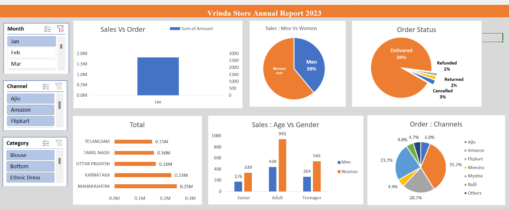

# 📊 Vrinda Store Annual Report 2023 - Sales Analysis Dashboard

Welcome to the **Vrinda Store Sales Analysis** project! This interactive Excel dashboard presents a complete breakdown of customer demographics, sales performance, and channel insights to help understand **Diwali season sales trends** and drive better business decisions.

---

## 🧾 Project Summary

This project analyzes **sales performance** across different dimensions using Microsoft Excel. The dashboard includes interactive filters for:

- **Month** (Jan, Feb, Mar)
- **Sales Channels** (Ajio, Amazon, Flipkart, etc.)
- **Product Categories** (Blouse, Bottom, Ethnic Dress, etc.)

---

## 📌 Key Visual Insights

| 📈 Chart | 📋 Description |
|---------|----------------|
| **Sales vs Orders** | Displays monthly total sales and order count. |
| **Sales: Men vs Women** | Pie chart showing gender-wise revenue contribution. |
| **Order Status** | Visual breakdown of Delivered, Returned, Refunded, and Cancelled orders. |
| **Top States by Sales** | Bar graph ranking states like Maharashtra, Karnataka, etc. by total sales. |
| **Sales by Age & Gender** | Compares sales of Men vs Women across age groups: Teenagers, Adults, and Seniors. |
| **Order Share by Channels** | Pie chart displaying % of orders received via platforms like Ajio, Flipkart, Meesho, Myntra, etc. |

---

## 🔧 Tools Used

- 🟠 **Microsoft Excel**
- 🔘 Pivot Tables & Charts
- 📌 Slicers for interactivity
- 📐 Data Modeling for multi-variable insights

---

## 💡 Insights Discovered

- **Women account for 61%** of total sales – strong opportunity for women-focused campaigns.
- **Adults (age 26-45)** dominate purchases across genders.
- **Maharashtra and Karnataka** lead in regional sales.
- **Flipkart and Amazon** are the top-performing channels.
- **94% of orders were successfully delivered** – strong logistics performance.

---

## 🧠 Use Case

This Excel dashboard can help:
- Business Owners identify top-performing channels and states.
- Marketers plan **targeted campaigns** by gender, age group, and region.
- Retail Analysts evaluate **return/cancellation trends**.
- Stakeholders track sales and order patterns during **festive seasons like Diwali**.

---

## 📂 How to Use

1. Download the Excel file from the repo.
2. Open it in Microsoft Excel (Office 2016 or later recommended).
3. Use the slicers (Month, Channel, Category) to filter the dashboard dynamically.
4. Explore the visuals and insights for better decision-making.

---

## 🎯 Conclusion

This project showcases the **power of Excel for storytelling with data**. With just pivot charts, slicers, and good design, you can create meaningful dashboards that support business goals and strategies.

---

## 🤝 Connect with Me

For feedback or collaboration, feel free to raise an issue or contact me via GitHub.

